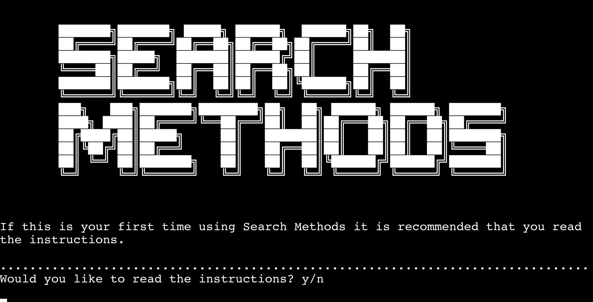

# Search Methods

Search methods is a practical learning program that demonstrates the differences between normal iteration through a list and binary search. The program itself runs in three ways that the user selects. It was clear from research that both the software developing and mathematical community agree that searching an ordered list in a binary way is superior in terms of speed. This program was initially created to test this hypothesis on a practical platform that can be manipulated by the user. Once consistent results were obtained that agree with the hypothesis and the rest of the developer community it was chosen by the creator to provide these results to young developers or mathematicians in three easy to understand outputs in order to demonstrate the benefits of using binary searches in their own programs.

## Instructions
Search Methods provides instructions to the user if requested to do so. This provides the user with details of how the program operates and what is is expected of the user. 

## Normal Search
Normal iteration through a list is the simplest way for a computer to search a list. For example, if there was an ordered list of 100 items and the computer was asked to find 99 it would inspect index item 0 and check if it was equal to 99, if not it would then find index item 1 and continue this process until the search for item is located.

## Binary Search
Binary search is best described by imagining a human searching in a dictionary. If the human was looking for the word "jester" they would likely not open the dictionary at page 1 and then 2 and so on. They would instead open the dictionary approximately half way through, say the letter "m". The human would know that the letter "m" comes after the letter "j" in the alphabet. They would then likely open a page between "a" and "m". This has effectively halved the "list" length. Computers can operate in this way too.

## Program Type
As mentioned the Search Methods python command line application can be used to run three mini programs selected by the user. Each one searches lists normally and using binary search. The program times the computer using the python datetime module and provides the desired output to the user.

### Program One
Program 1 - the simplest program that takes a user selected list length between 100 and 10000000 (10 million) identifies a random number to search for and times the computer searching. It provides the raw results in microseconds and also assesses the difference over 100000 iterations to put the time difference into perspective.

### Program Two
Program 2 - this program works by taking a specified list length between 100 and 10000000 (10 million) and searches for 50 numbers within that specified list length normally and by binary search. It provides the time taken to perform the normal search as a list of 50 items and the time taken to perform the binary search as a list of 50 items. You can take this data and plot it within a graph. You should see that the time taken to perform the binary search is significantly lower.

### Program Three
Program 3 - this program takes a user specified maximum list length and searches this list and 49 smaller lists identified by taking the specified length and dividing it by 50. The program then searches for the maximum number (index item -1) it once again provides two lists of 50 items the first being normal search and the second being binary search. You should once again see a significant reduction in the time taken using binary search. You should also see the binary search data forming a logarithmic pattern. This data can be taken and plotted in a graph.

## Core Concepts
This project uses many different aspects of python. Loops and searches are used extensively as well as appending lists to provide the test lists and the list supplied to the user following the program. There are however certain key concepts that are mentioned below that are fundamental to the operation of this program.

### Random and DateTime
Two imported modules are used within this python project Random and Datetime. Random is used within the operation of program 1 to select a random number within the list length to be searched for by the program. Datetime is used to time the program during its search and is crucial to the working of this application. A high degree of accuracy is required and Datetime provides this by giving the time in microseconds the time between start and finish is calculated that the result is the number of microseconds it took the program to perform the search.

### Searches
Another key concept in the creation of this project was the ability to search through a list by normal iteration and binary search. Without these two key functions the program would not be able to perform its purpose.

### 10 Million
An upper limit needed to be specified for list length searches. This was originally capped at 1 million during the first stages of development. The goal of the creator was to use the maximum possible number that still provides results in a reasonable timeframe. There is of course no benefit to making the user wait longer for no expressed reason. The maximum list length was changed to 1 billion during development but this was subsequently changed to 10 million due to the time taken to search through a list of 1 billion items.

## Usability and Errors
A key goal of the creator was to create a program that would not end abruptly following an unknown user input and would be clear what was required of the user at all stages. Time has been spent making sure that every time the user inputs a word, letter or number that other permutations were accounted for and did not unexpectedly end the program. It was also necessary to monitor the users input of requested list length as a number too great would cause the application to run for extensive periods of time.

Exit points have also been created to allow for a safe exit of the program at certain points if the user no longer wishes to use this application.

## Results
From testing it appears that at all times results from the program agree with what is expected from the hypothesis. The results are consistent and do not appear to have any systematic errors arriving from poor methodology.

## Target audience
Search Methods is targeted towards young developers or mathematicians that have an understanding of some aspects of software development. Its purpose is to test a hypothesis based on the theory that binary search is a superior method to search through an ordered list. It is young developers that benefit most from learning about this way of searching.

## Deployment
Search Methods was deployed to Heroku on 19/06/2024. The program runs as intended but requires changes in terms of printed statements and the function used to separate areas of text.

### Changes
The create_separation function was altered such that there is one line of dots separating the areas of text. Whilst three lines appeared appropriate on the Gitpod terminal it was too large on the deployed site.

Many of the printed statements were shortened to only include crucial data. This makes the program more concise. Users are guided towards the README.md file if they still require further information after reading the instructions.

## Future Considerations
Whilst it is beyond the scope of this project, using the search methods program in conjunction with a front-end web application that can take the data from the user, perform the operation and then supply a graph readout would be highly beneficial to a user so they can see visually the data and the time taken to perform the commands.

## Testing
Testing was done using: https://extendsclass.com/python-tester.html

This resulted in no errors detected throughout the document. 

## References 

### ASCII Banner 
ASCII banner loaded at the start of the project from: https://manytools.org/hacker-tools/ascii-banner/ 